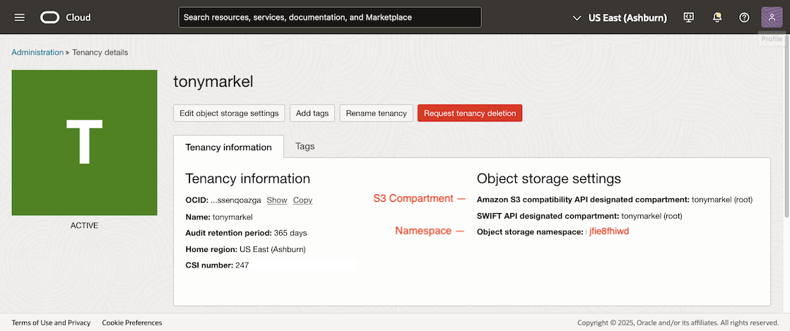
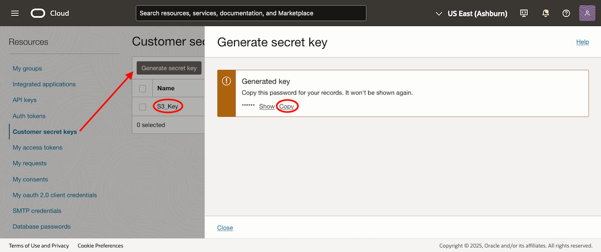
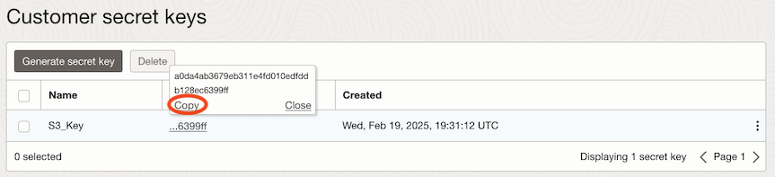
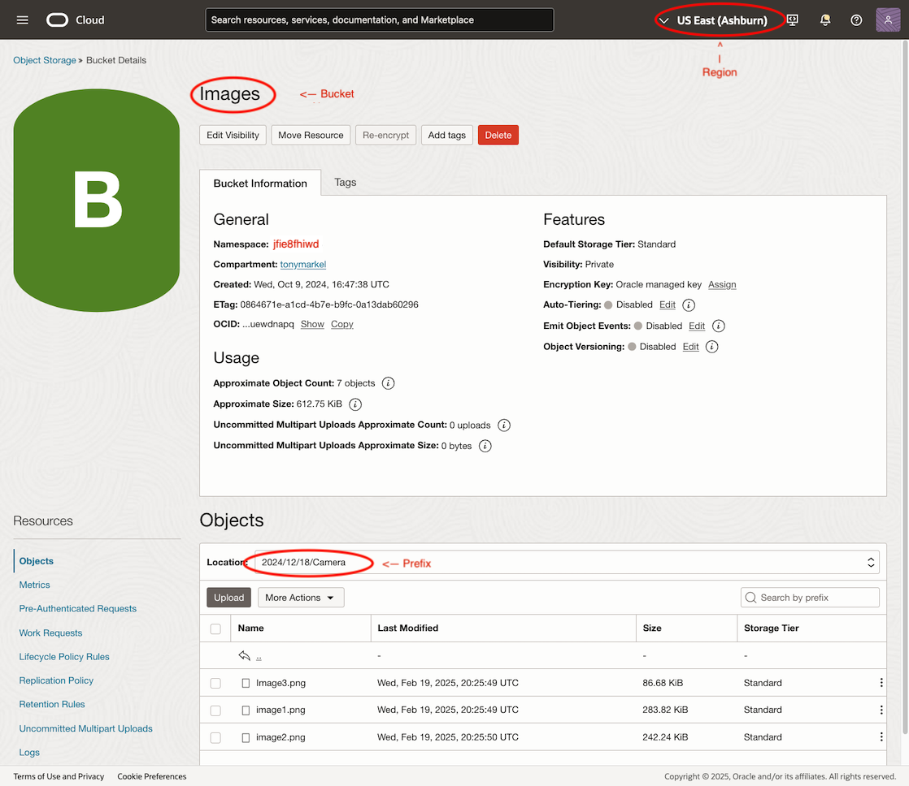

# Learn how to use the OCI Object Storage S3 Compatibility API with the AWS C++ SDK 

## Introduction 

Oracle Cloud Infrastructure (OCI) Object Storage enables customers to securely store any type of data in its native format. With built-in redundancy, OCI Object Storage is ideal for building modern applications that require scale and flexibility, as it can be used to consolidate multiple data sources for analytics, backup, or archive purposes. 

OCI Object Storage is foundational to cloud workloads; it is elasticity, scalability, reliability, and cost efficiency has made it the primary storage for unstructured data in the cloud. As a result of its popularity there is a vast ecosystem of tools to work with OCI Object Storage.

### Audience 

Developer, DevOps Engineer 

### Background

OCI Object Storage provides an Amazon S3 Compatibility API, customers can continue to use their existing Amazon S3 tools (for example, SDK clients) and make minimal changes to their applications to work with Object Storage. The Amazon S3 Compatibility API and Object Storage datasets are congruent. If data is written to the Object Storage using the Amazon S3 Compatibility API, the data can be read back using the native Object Storage API and conversely. Customers who use the AWS C++ SDK may find authentication aspect challenging, this tutorial aims to provide 2 simple examples to get started on using the AWS C++ SDK.

When following the [code examples produced by AWS](https://docs.aws.amazon.com/sdk-for-cpp/v1/developer-guide/examples-s3-buckets.html), and substituting values takes from your OCI tenancy, will typically manifest as an error like the following:

```
curlCode: 60, SSL peer certificate or SSH remote key was not OK
```
This is because the SDK places the bucket name in the front of the URL by default. For OCI, this URL does not work.

for example:
`https://myBucket.myNamespace.compat.objectstorage.uk-london-1.oraclecloud.com` _will not_ reference the bucket in OCI, or a valid certificate.
but:
`https://myNamespace.compat.objectstorage.uk-london-1.oraclecloud.com/myBucket` _will_ reference a bucket and return a valid certificate.

In order to use the AWS C++ SDK, you will need to force the SDK to use an older version of the HTTP request.

This is done by using the following setting with the S3Client:
```
Aws::Client::ClientConfiguration config;
S3Client s3Client(config, Aws::Client::AWSAuthV4Signer::PayloadSigningPolicy::Never, false);
```

Full details below:

### Objective 

Learn how to avoid SSL certificate and authentication issues when using the AWS C++ SDK with OCI Object Storage. 

* ListBuckets 
* ListObjectsV2 

### Prerequisites 

* An OCI account.

* User permission to read buckets and objects in OCI Object Storage. For more information, see [Let users download objects from Object Storage buckets](https://docs.oracle.com/en-us/iaas/Content/Identity/Concepts/commonpolicies.htm#).

* Familiar with:

    * Using a terminal or shell interface on Mac OS, Linux, Berkeley Software Distribution (BSD) and on Windows PowerShell, command prompt, or bash.
    * Installing software on a Linux system.

* Linux Host (Ubuntu/RHEL Clone) with the following installed:

    * [AWS C++ SDK](https://docs.aws.amazon.com/sdk-for-cpp/v1/developer-guide/setup-linux.html) Note: these shared libraries must be in the `LD_LIBRARY_PATH`
    * [OCI CLI](https://docs.oracle.com/en-us/iaas/Content/API/SDKDocs/cliinstall.htm#Quickstart)

## Get the required information from the OCI Console

### Configure Object Storage Settings and Retrieve Your Namespace

* Under your profile in the upper-right corner of the screen, select _tenancy: (your tenancy name)_ and confirm the compartment where all S3 Compatible buckets will reside. By default this is the root compartment. Buckets outside of this compartment cannot use the S3 Compatible API.
* Note the namespace, you'll need it later for the S3 endpoint

### Get credentials for accessing the AWS S3 Compatible API

* Under your profile, select _user settings_
* Scroll down and select _Customer secret keys_
* Click _Generate Secret Key_, enter a name and click _Generate Secret Key_ at the bottom of the overlay window
* Copy the generated key to a secure location
* Click _close_ 
* Copy the _Access Key_ to a secure location



### Get a bucket with objects in the S3 compatible compartment

* Note the *Bucket Name*
* Note the Location. This will be used as the *prefix*.
* Note the Region and get the code from [here](https://docs.oracle.com/en-us/iaas/Content/General/Concepts/regions.htm)
    * e.g. US East (Ashburn) = `us-ashburn-1`

### Set Some Environment Variables
Using the information you've gathered, set some environment variables for use with the program. Below uses Bash syntax.

Example
```
export AWS_ACCESS_KEY_ID="da34baaa4ab029f51c34c1cee83d40f0dEXAMPLE"
export AWS_SECRET_ACCESS_KEY="7w3uMS6kYiYkUpziSlLFcBimBsYDJfojwCWKEXAMPLE="
export OCI_REGION="us-ashburn-1"
export OCI_NAMESPACE="jfie8fhiwd"
export OCI_BUCKET="Images"
export OCI_PREFIX="2024/12/18/Camera"
```

## Build the examples
```
git clone https://github.com/tonymarkel/OCI_AWS_CPP_SDK_S3_Examples.git
cd OCI_AWS_CPP_SDK_S3_Examples
mkdir build
cd build
cmake ..
make
```

## Run the examples

### listBuckets
```
./listBuckets $OCI_NAMESPACE $OCI_REGION $AWS_ACCESS_KEY_ID $AWS_SECRET_ACCESS_KEY
```
Where Region, Namespace, Bucket, and Prefix are taken from your Buckets in the OCI Console.
AWS_ACCESS_KEY_ID and AWS_SECRET_KEY_ID are generated in your profile in the OCI Console.
```
S3 Endpoint is: https://jfie8fhiwd.compat.objectstorage.us-ashburn-1.oraclecloud.com/
Found 3 buckets
Demo
Images
Logs
```

### listObjects
```
./listObjects $OCI_NAMESPACE $OCI_REGION $AWS_ACCESS_KEY_ID $AWS_SECRET_ACCESS_KEY $OCI_BUCKET $OCI_PREFIX
```
```
S3 Object Path is: https://jfie8fhiwd.compat.objectstorage.us-ashburn-1.oraclecloud.com
Bucket is: Images
Prefix is: 2024/12/18/Camera
LISTING OBJECTS
Found 3 objects
2024/12/18/Camera/Image1.jpeg
2024/12/18/Camera/Image2.jpeg
2024/12/18/Camera/DefinitelyNotACat.jpeg
```

## Related Links 

* [Object Storage Amazon S3 Compatibility API](https://docs.oracle.com/en-us/iaas/Content/Object/Tasks/s3compatibleapi.htm)
* [AWS SDK for C++](https://aws.amazon.com/sdk-for-cpp/)
* [AWS SDK for C++ Version 1.8](https://aws.amazon.com/blogs/developer/aws-sdk-for-cpp-version-1-8/)
* [using s3_force_path_style in C++](https://github.com/aws/aws-sdk-cpp/issues/587)
* [How to use MinIO with AWS C++ SDK?](https://github.com/minio/minio/issues/10176)

## Acknowledgments 

- **Authors** - Kenneth Heung (Master Principal Cloud Architect), Tony Markel (Principal Cloud Architect)

- **Contributors** - Melinda Centeno (Senior Principal Product Manager)